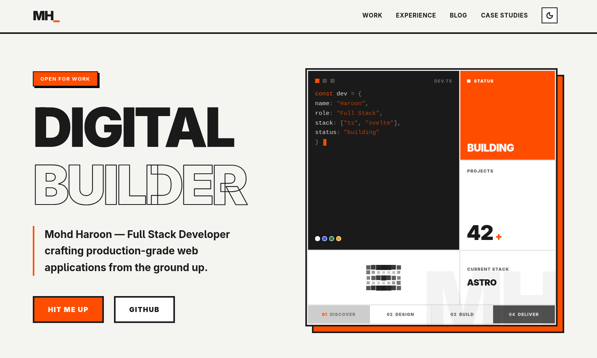

# Portfolio V4

Bold, editorial-style portfolio template built with Astro + Svelte. Designed to showcase projects, experience, blog posts, and case studies with crisp motion and high-contrast typography.




## Features

- Editorial typography and strong hierarchy
- Astro content collections with MDX for blog posts and case studies
- Svelte components for interactive sections
- Tailwind CSS theme tokens and global styling
- GSAP scroll-triggered reveals
- View Transitions between list and detail pages
- Astro 6 Fonts API (self-hosted Google fonts via `astro:assets`)
- Optional Astro 6 CSP support (enabled via env flag)

## Tech Stack

- Astro
- Svelte
- Tailwind CSS
- MDX
- GSAP
- Bun

## Requirements

- Bun (recommended for scripts below)
- Node.js `>= 22.12.0` (see `.nvmrc`)

## Quick Start

```bash
bun install
bun dev
```

Open `http://localhost:4321`.

## Build and Preview

```bash
bun build
bun preview
```

## Astro 6 Features

### Fonts API

The project uses Astro's built-in Fonts API to register and self-host:

- `Space Grotesk` (`--font-space-grotesk`) for UI/body text
- `JetBrains Mono` (`--font-jetbrains-mono`) for code blocks

Fonts are configured in `astro.config.mjs` and applied in `src/layouts/Layout.astro` using `<Font />` from `astro:assets`.

### CSP (optional)

Astro CSP is available behind an env toggle because this site currently uses View Transitions (`<ClientRouter />`) and Shiki-powered syntax highlighting, which are limited with CSP mode.

Enable it only when testing CSP behavior:

```bash
ASTRO_ENABLE_CSP=true bun build
```

When the variable is not set, CSP remains disabled.

## Scripts

| Command | Description |
| --- | --- |
| `bun dev` | Start the dev server |
| `bun build` | Build the production site |
| `bun preview` | Preview the production build |
| `bun lint` | Run Biome lint |
| `bun format` | Format with Biome |

## Project Structure

```text
src/
  components/         Svelte components
  content/
    blog/             Blog posts (MDX)
    case-studies/     Case studies (MDX)
  layouts/            Page layouts
  pages/              Astro routes
  styles/             Global styles and tokens
```

## Customize

- Update the homepage sections in `src/pages/index.astro`
- Edit component copy in `src/components`
- Add or edit posts in `src/content/blog`
- Add or edit case studies in `src/content/case-studies`
- Adjust theme tokens in `src/styles/global.css`

## Deployment

This is a static Astro build. After `bun build`, deploy the `dist/` directory to your host of choice.

## License

MIT. See `LICENSE`.
